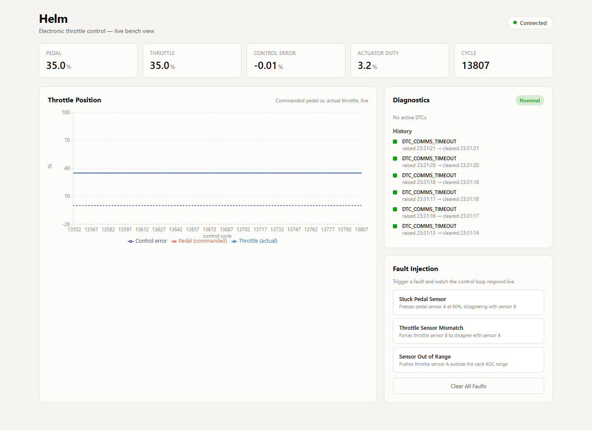
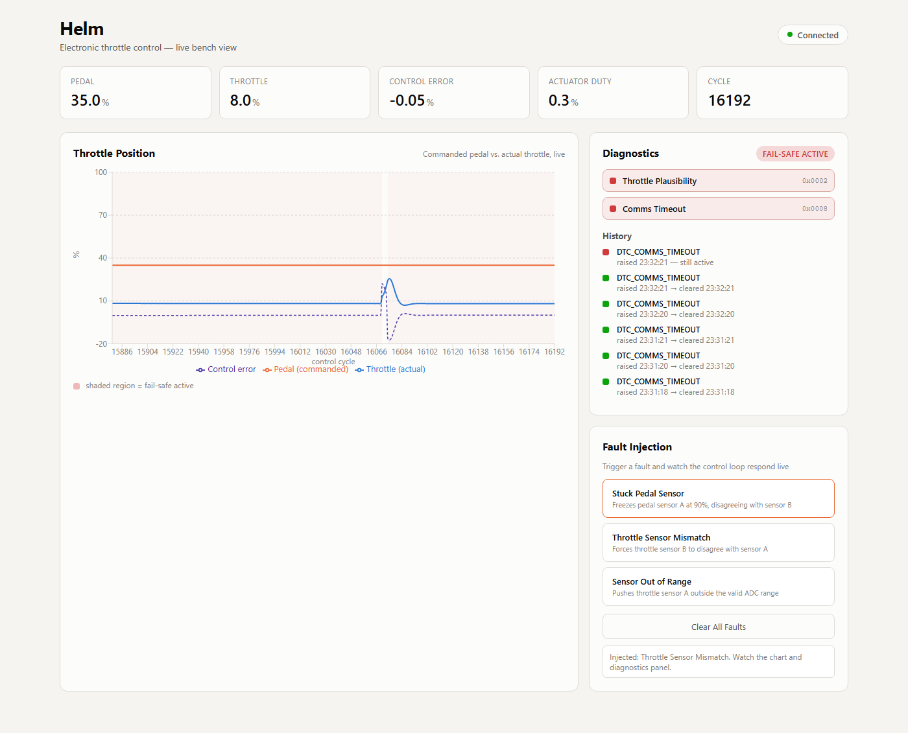
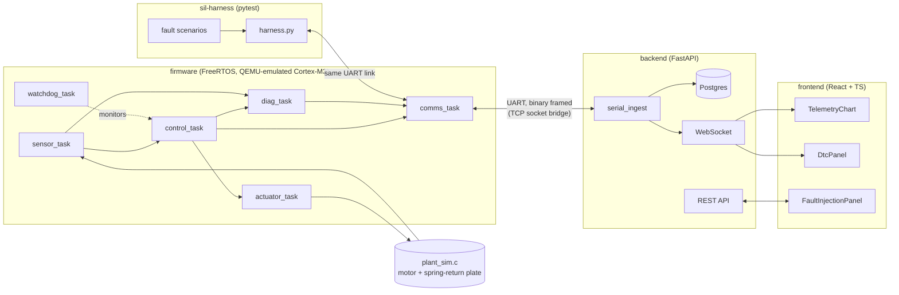

# Helm

**A closed-loop electronic throttle control (ETC) unit — embedded C firmware on FreeRTOS, a software-in-the-loop fault-injection test rig, and a live telemetry dashboard.**

Helm simulates the kind of safety-critical actuator control that sits at the heart of every automotive VCU/ECU/TCU: dual redundant sensors, a PID control loop closing the gap between commanded and actual throttle position, a diagnostic layer that raises trouble codes and forces a fail-safe limp-home state the instant a sensor stops making sense — and a test harness that proves it, by breaking it on purpose, over and over, automatically.

<p align="center">
  
</p>

## The demo

Trigger a fault from the dashboard and watch the whole stack respond in real time — the firmware detects it, raises the diagnostic trouble code, forces the throttle to its fail-safe limp-home angle, and the chart shows the entire transition as it happens:

<p align="center">
  
</p>

Above: a throttle-sensor mismatch was injected from the **Fault Injection** panel at cycle ~16060. Within 5 control cycles (50ms) the firmware raised `DTC_THROTTLE_PLAUSIBILITY`, forced fail-safe, and the actual throttle position (blue) dropped from tracking the 35% commanded pedal (orange) to the 8% limp-home angle — all visible on the chart as it happened, no manual refresh, no polling.

## Why this exists

Most portfolio projects that touch "full-stack" mean a web app with a database. This one goes a layer deeper: **firmware first**. The control loop, the sensor plausibility checks, the fail-safe state machine — all of it runs as real embedded C on a real RTOS, the same way it would on the silicon inside an actual throttle body. The backend and frontend exist to observe and exercise that firmware, not to fake it.

The centerpiece is `sil-harness/` — a Python test rig that boots the firmware under QEMU, drives it through realistic driving-style inputs, and systematically injects the fault modes a real ECU has to survive: a sensor stuck at a frozen value, two redundant sensors disagreeing, a reading pinned outside the valid ADC range, a lost communication link. Every scenario asserts not just *that* the firmware detects the fault, but *how fast* — against the same latency budgets a real functional-safety spec would set.

## Architecture



Firmware and test harness are the load-bearing parts of this project; backend and frontend are a thin, real-time window onto them.

## The fault-injection suite

This is the single highest-signal piece of the project — automated regression coverage of every failure mode the firmware is designed to catch, each one measured against a latency budget instead of just "pass/fail":

| Scenario | Fault | Firmware must... |
|---|---|---|
| `stuck_pedal_sensor` | Pedal sensor A freezes | Raise `DTC_PEDAL_PLAUSIBILITY` within 5 cycles, fail-safe within 1 more, clear within 20 cycles of removal |
| `throttle_sensor_mismatch` | Throttle sensors disagree | Same, for `DTC_THROTTLE_PLAUSIBILITY` |
| `sensor_out_of_range` | Sensor pinned outside valid ADC range | Raise `DTC_SENSOR_OUT_OF_RANGE` **immediately** (no debounce), clear after 20 healthy cycles |
| `comm_timeout_recovery` | Harness goes silent | Raise `DTC_COMMS_TIMEOUT` within 500ms, clear on the very next valid frame |
| `healthy_regression` | *(none — 5 minutes of randomized driving)* | **Zero** false-positive DTCs |

All five run as a single `pytest` command, each booting a fresh QEMU instance so no fault-injection state leaks between scenarios, and produce a latency report. Two real bugs were found and fixed by this suite during development — a harness backlog issue and an over-eager test profile — documented in [`progress.md`](progress.md).

## Quickstart

```bash
docker compose up
```

Brings up the firmware (QEMU), Postgres, backend, and frontend together. Frontend at `http://localhost:5173`, backend API at `http://localhost:8000`.

> **Honesty note:** this project was built on a machine without Docker available, so `docker-compose.yml` and the three Dockerfiles are carefully written and YAML/syntax-validated but have **not** been run end-to-end with a real `docker compose up`. Every other piece of this system — firmware under QEMU, the SiL suite, the backend against real Postgres, the frontend in a real browser — was fully run and verified; see `progress.md` for exact commands and results. If something's off in the Docker path, it's the one part of this stack that's unverified.

### Manual setup (what was actually used to build and verify this)

Each component has its own README with exact commands: [`firmware/`](firmware/), [`sil-harness/`](sil-harness/), [`backend/`](backend/), [`frontend/`](frontend/). Short version:

```bash
# 1. Firmware
cd firmware && mkdir build-arm && cd build-arm
cmake -G Ninja -DCMAKE_TOOLCHAIN_FILE=../cmake/arm-none-eabi-toolchain.cmake ..
ninja
qemu-system-arm -M mps2-an385 -nographic -kernel helm.elf \
  -chardev socket,id=serial0,host=127.0.0.1,port=5678,server=on,wait=off \
  -serial chardev:serial0 -monitor none

# 2. Backend (new terminal)
cd backend && python -m venv .venv && .venv/Scripts/pip install -r requirements.txt
.venv/Scripts/python -m uvicorn app.main:app --reload

# 3. Frontend (new terminal)
cd frontend && npm install && npm run dev
```

### Run the fault-injection suite

```bash
cd sil-harness
python -m venv .venv && .venv/bin/pip install -r requirements.txt
.venv/bin/python -m pytest -v -s
```

### Run the firmware unit tests

```bash
cd firmware && mkdir build && cd build
cmake -G Ninja .. && ninja && ./helm_host_tests.exe
```

Pure control-math tests (PID settling/overshoot, plausibility debounce, wire protocol) — no RTOS, no QEMU, runs in under a second.

## Tech stack

| Layer | Stack |
|---|---|
| Firmware | C11, FreeRTOS v10.6.2, ARM Cortex-M3 (QEMU `mps2-an385`), CMake + arm-none-eabi-gcc |
| SiL harness | Python 3, pytest, raw sockets (see Windows note below) |
| Backend | Python, FastAPI, SQLAlchemy (async), Postgres / SQLite |
| Frontend | React 19, TypeScript, Vite, Recharts |
| Orchestration | Docker Compose |

**Windows note:** the build plan called for QEMU's `-serial pty`, which is POSIX-only. This project substitutes a TCP socket chardev (`-chardev socket,...`) everywhere — functionally identical (a byte stream), and it's what makes the SiL harness and backend portable to any host QEMU supports, not just Linux/macOS.

## Repo structure

```
helm/
├── firmware/          Embedded C, FreeRTOS, builds to helm.elf, runs under QEMU
├── sil-harness/        Python pytest suite: boots firmware, injects faults, measures latency
├── backend/            FastAPI: ingests telemetry, exposes REST + WebSocket
├── frontend/           React/TS live dashboard
├── docker-compose.yml
└── progress.md         Full build log: every decision, every bug found and fixed, exact commands
```

`progress.md` is worth a read if you want the unfiltered story — every phase's actual definition-of-done check, the real bugs hit along the way (a boot-time watchdog race, a QEMU UART transport quirk that skewed test latency measurements, a stale-package ABI mismatch that took down `cmake` entirely), and how each was diagnosed and fixed.

## What's simulated vs. real

Everything runs as genuine embedded firmware on a genuine RTOS under a cycle-accurate CPU emulator — this isn't a Python model pretending to be an ECU. What's simulated is the *plant*: `plant_sim.c` is a discrete-time motor + spring-return throttle-plate model standing in for a real DC motor and potentiometer, exactly the swap point a real HiL rig would use. The control, diagnostic, and comms logic are unchanged either way — only the sensor-read and actuator-write functions would need to become real GPIO/ADC/PWM calls to turn this into genuine hardware-in-the-loop testing on an STM32 Nucleo.

## License

MIT — see [LICENSE](LICENSE).
